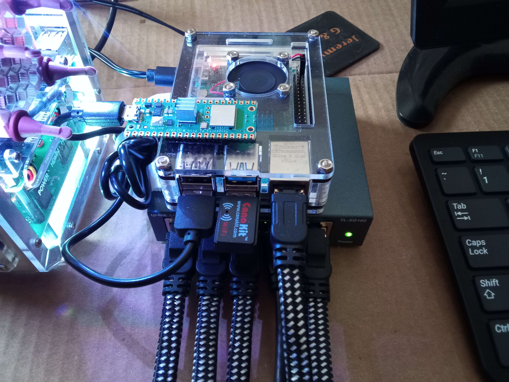

# Pi-Router-Readme
This is a breif description of the router made and used by shadowdrums and ShadowTEAM 

# Raspberry Pi 4B (2GB) Router with OpenWRT

## Purpose and Benefits

This custom router project was created with the primary goal of establishing a separate network dedicated to handling external SSH traffic. This setup offers several advantages:

- **Enhanced Security**: By segregating external SSH traffic from the main local network, you create an additional layer of security, minimizing potential risks associated with direct access to sensitive systems.

- **Optimized Network Performance**: Allocating a dedicated network for SSH traffic ensures that it doesn't compete with other activities on the main network, resulting in smoother, more reliable connections.

- **Isolation of Services**: The isolated network allows you to manage and monitor SSH connections separately, making it easier to identify and respond to any unusual activity.

- **Flexibility and Control**: This setup provides you with greater control over SSH access, allowing for specific configurations tailored to your needs.

## Project Overview

This project showcases the creation of a custom router using a Raspberry Pi 4B with 2GB of RAM, running the powerful OpenWRT operating system. This setup leverages the Raspberry Pi's capabilities alongside OpenWRT's robust networking features. It makes use of a Cana Kit external WiFi adapter for broadcasting a WiFi signal. Additionally, the internal WiFi card of the Pi connects to the main router for internet access. For wired connections, a 5-port unmanaged TP-Link Ethernet switch is integrated. To regulate temperature, a fan is included within the custom case. The Pi router is securely mounted on top of the switch using Velcro. Furthermore, a Pico W is Velcroed to the top of the router, providing essential functionality.

## Key Features

- **Hardware**:
  - Raspberry Pi 4B (2GB)
  - Cana Kit external WiFi adapter
  - 5-port unmanaged TP-Link Ethernet switch
  - Case with integrated fan

- **Wireless Capabilities**:
  - The Cana Kit adapter enables the broadcast of a WiFi signal.
  - The Pi's internal WiFi card establishes a connection to the main router for internet access.

- **Wired Networking**:
  - A 5-port TP-Link switch provides reliable wired connections for devices.

- **Temperature Regulation**:
  - A dedicated fan is integrated into the custom case, ensuring optimal operating temperatures.

- **Secure Mounting**:
  - The Pi router is securely attached to the TP-Link switch using Velcro strips.
  - A Pico W is Velcroed on top of the router, enhancing its capabilities.

- **Pico W Keep-Alive**:
  - The Pico W is connected to the Pi router via its internal WiFi card. It serves as a keep-alive mechanism for the SSH server, ensuring continuous connectivity even in the event of network disruptions.

## Setup Instructions

1. **Installing and Setting up OpenWRT**

   - For detailed guidance on installing and setting up OpenWRT on your Raspberry Pi 4B (2GB), refer to [NetworkChuck's YouTube video](https://youtu.be/jlHWnKVpygw?si=IynAIzmYvfIfmMXd) which provides an excellent step-by-step walkthrough.

2. **Hardware Assembly**
   - Attach the Cana Kit external WiFi adapter to the Raspberry Pi's USB port.
   - Connect the Pi's internal WiFi card to the main router for internet access.
   - Connect devices requiring wired connections to the TP-Link Ethernet switch.

3. **Software Configuration**
   - Follow the official documentation to install OpenWRT on the Raspberry Pi 4B (2GB).
   - Configure wireless networks and network interfaces for optimal performance.
   - Set up port forwarding rules to allow external access.

4. **Temperature Regulation**
   - Ensure the case fan is securely connected to the Raspberry Pi.
   - Adjust fan speed settings as necessary to maintain optimal operating temperatures.

5. **Velcro Mounting**
   - Attach the Raspberry Pi router securely to the top of the TP-Link switch using Velcro strips.
   - Velcro mount the Pico W to the top of the router for enhanced functionality.

6. **SSH Access Configuration**
   - Set up a Raspberry Pi 4B (8GB) with Kali Linux and configure the SSH server.
   - Establish port forwarding on the main router to facilitate external SSH access.

## Additional Considerations

- Keep the system updated with the latest security patches to ensure optimal performance and security.
- Regularly monitor the Raspberry Pi's temperature and adjust fan settings if necessary to prevent overheating.

Feel free to tailor this README to include any specific details about your setup or additional functionalities you may have implemented. Enjoy the enhanced capabilities of your Raspberry Pi 4B (2GB) router with OpenWRT!
